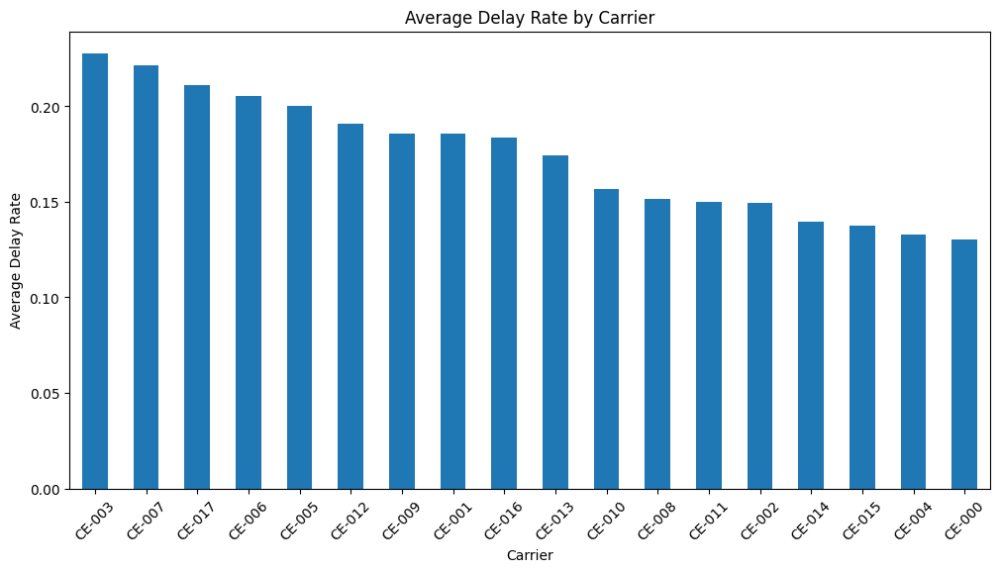
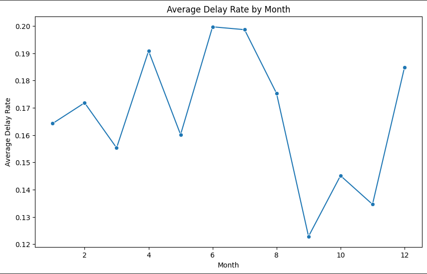
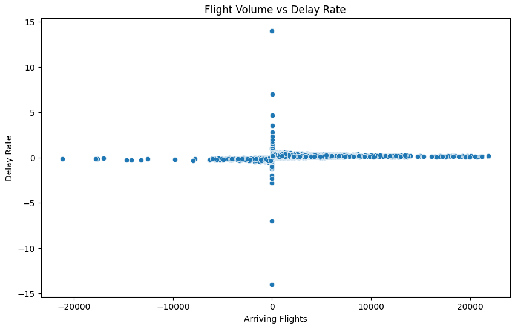
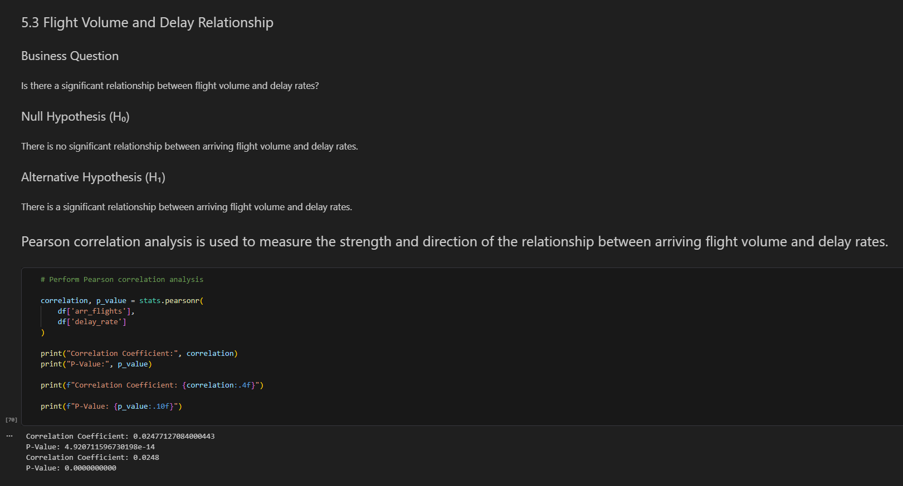
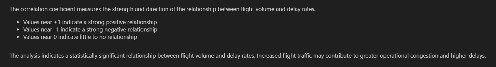

# ✈️ Airline Delay Performance Analysis

## 📌 Project Overview

This project analyzes airline operational performance data to identify patterns, trends, and statistical relationships related to flight delays and cancellations.

The project combines:
- Data cleaning and preprocessing
- Exploratory Data Analysis (EDA)
- Feature engineering
- Statistical hypothesis testing
- Correlation analysis
- Business recommendations

The analysis was performed using Python and several data science libraries to evaluate how operational variables influence airline delay performance.

---

## 🎯 Project Objectives

The primary objectives of this project were to:

- Identify patterns in airline delays and cancellations
- Compare delay performance across airline carrier groups
- Analyze airport-specific operational delay behavior
- Examine seasonal trends in delays
- Evaluate relationships between flight volume, cancellations, and delays
- Apply statistical testing to validate analytical findings

---

## 🛠️ Technologies Used

- Python
- Pandas
- NumPy
- Matplotlib
- Seaborn
- SciPy
- Jupyter Notebook

---

## 📊 Project Workflow

### 1. Data Cleaning & Preprocessing
- Handled missing values using median imputation
- Removed duplicate records
- Standardized categorical variables
- Created engineered operational metrics

### 2. Exploratory Data Analysis (EDA)
- Delay distribution analysis
- Airline carrier comparisons
- Airport delay analysis
- Seasonal trend visualization
- Cancellation pattern analysis

- 
## 📊 Sample Visualizations

### Average Delay Rate by Carrier



### Monthly Delay Trends



### Flight Volume vs Delay Rate



---

### 3. Statistical Analysis
- Independent T-Test Analysis
- One-Way ANOVA
- Pearson Correlation Analysis





---

### 4. Business Insights & Recommendations
- Operational congestion analysis
- Seasonal planning recommendations
- Cancellation-response considerations
- Data-driven operational improvement suggestions

---

## 🔬 Statistical Methods Applied

| Method | Purpose |
|---|---|
| Independent T-Test | Compare airline delay rates |
| One-Way ANOVA | Compare delay variation across months |
| Pearson Correlation | Evaluate relationships between operational variables |

---

## 📈 Key Findings

- Delay behavior varied across airline carrier groups
- Certain airports demonstrated consistently higher delay rates
- Seasonal trends influenced operational performance
- Flight volume showed statistically significant but weak relationships with delay rates
- Cancellation behavior demonstrated measurable relationships with operational disruptions

---

## 📁 Repository Structure

```text
airline-delay-analysis/
│
├── README.md
├── Airline_Delay_Analysis.ipynb
├── Airline_Delay_Analysis.html
├── requirements.txt
└── images/
```

---

## 🚀 Future Improvements

Future versions of this project may include:

- Weather data integration
- Predictive machine learning models
- Route-level operational analysis
- Interactive dashboards
- Real-time airline performance monitoring

---

## 👤 Author

**James (Jake) Grolig**  
Applied AI Student | Python | Data Science | AI Development
